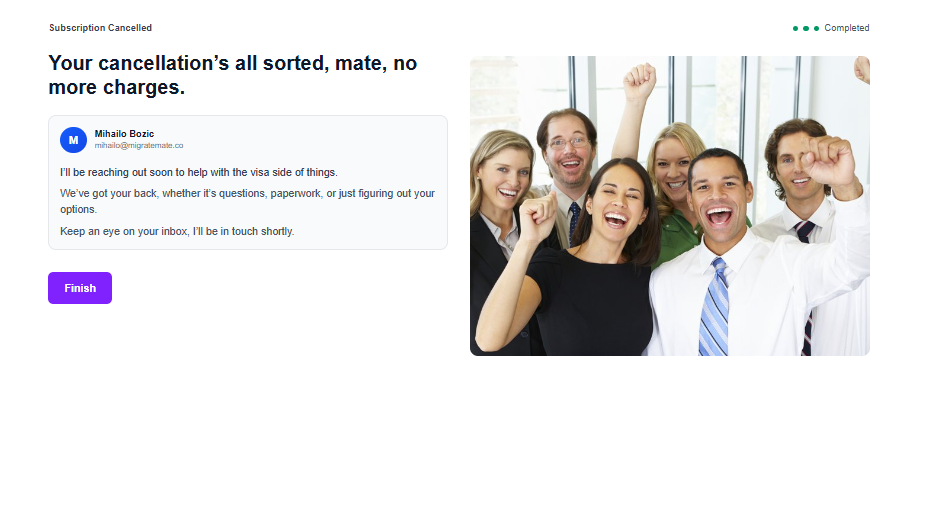

# Migrate Mate - Subscription Cancellation Flow Challenge

## Overview

Convert an existing Figma design into a fully-functional subscription-cancellation flow for Migrate Mate. This challenge tests your ability to implement pixel-perfect UI, handle complex business logic, and maintain security best practices.

## Objective

Implement the Figma-designed cancellation journey exactly on mobile + desktop, persist outcomes securely, and instrument the A/B downsell logic.

## What's Provided

This repository contains:
- ✅ Next.js + TypeScript + Tailwind scaffold
- ✅ `seed.sql` with users table (25/29 USD plans) and empty cancellations table
- ✅ Local Supabase configuration for development
- ✅ Basic Supabase client setup in `src/lib/supabase.ts`

## Tech Stack (Preferred)

- **Next.js** with App Router
- **React** with TypeScript
- **Tailwind CSS** for styling
- **Supabase** (Postgres + Row-Level Security)

> **Alternative stacks allowed** if your solution:
> 1. Runs with `npm install && npm run dev`
> 2. Persists to a Postgres-compatible database
> 3. Enforces table-level security

## Must-Have Features

### 1. Progressive Flow (Figma Design)
- Implement the exact cancellation journey from provided Figma
- Ensure pixel-perfect fidelity on both mobile and desktop
- Handle all user interactions and state transitions

### 2. Deterministic A/B Testing (50/50 Split)
- **On first entry**: Assign variant via cryptographically secure RNG
- **Persist** variant to `cancellations.downsell_variant` field
- **Reuse** variant on repeat visits (never re-randomize)

**Variant A**: No downsell screen
**Variant B**: Show "$10 off" offer
- Price $25 → $15, Price $29 → $19
- **Accept** → Log action, take user back to profile page (NO ACTUAL PAYMENT PROCESSING REQUIRED)
- **Decline** → Continue to reason selection in flow

### 3. Data Persistence
- Mark subscription as `pending_cancellation` in database
- Create cancellation record with:
  - `user_id`
  - `downsell_variant` (A or B)
  - `reason` (from user selection)
  - `accepted_downsell` (boolean)
  - `created_at` (timestamp)

### 4. Security Requirements
- **Row-Level Security (RLS)** policies
- **Input validation** on all user inputs
- **CSRF/XSS protection**
- Secure handling of sensitive data

### 5. Reproducible Setup
- `npm run db:setup` creates schema and seed data (local development)
- Clear documentation for environment setup

## Out of Scope

- **Payment processing** - Stub with comments only
- **User authentication** - Use mock user data
- **Email notifications** - Not required
- **Analytics tracking** - Focus on core functionality

## Getting Started

1. **Clone this repository** `git clone [repo]`
2. **Install dependencies**: `npm install`
3. **Set up local database**: `npm run db:setup`
4. **Start development**: `npm run dev`

## Database Schema

The `seed.sql` file provides a **starting point** with:
- `users` table with sample users
- `subscriptions` table with $25 and $29 plans
- `cancellations` table (minimal structure - **you'll need to expand this**)
- Basic RLS policies (enhance as needed)

### Important: Schema Design Required

The current `cancellations` table is intentionally minimal. You'll need to:
- **Analyze the cancellation flow requirements** from the Figma design
- **Design appropriate table structure(s)** to capture all necessary data
- **Consider data validation, constraints, and relationships**
- **Ensure the schema supports the A/B testing requirements**

## Evaluation Criteria

- **Functionality (40%)**: Feature completeness and correctness
- **Code Quality (25%)**: Clean, maintainable, well-structured code
- **Pixel/UX Fidelity (15%)**: Accuracy to Figma design
- **Security (10%)**: Proper RLS, validation, and protection
- **Documentation (10%)**: Clear README and code comments

## Deliverables

1. **Working implementation** in this repository
2. **NEW One-page README.md (replace this)** (≤600 words) explaining:
   - Architecture decisions
   - Security implementation
   - A/B testing approach
3. **Clean commit history** with meaningful messages

## Timeline

Submit your solution within **72 hours** of receiving this repository.

## AI Tooling

Using Cursor, ChatGPT, Copilot, etc. is **encouraged**. Use whatever accelerates your development—just ensure you understand the code and it runs correctly.

## Questions?

Review the challenge requirements carefully. If you have questions about specific implementation details, make reasonable assumptions and document them in your README.

---

**Good luck!** We're excited to see your implementation.

---

## Implemented Solution

This project implements a subscription cancellation flow for Migrate Mate, a fictional company. The primary focus of this project is to create a seamless and user-friendly experience for users who wish to cancel their subscriptions, while also incorporating a downsell offer to reduce churn.

### Features

*   **Pixel-Perfect UI**: The cancellation flow is implemented with a focus on being pixel-perfect according to the provided Figma designs for both mobile and desktop views.
*   **A/B Testing**: A deterministic A/B testing mechanism is in place to test the effectiveness of a downsell offer. 50% of users are presented with a discount, while the other 50% proceed directly to the cancellation reason form.
*   **Secure Data Persistence**: All cancellation data, including the reason for cancellation and whether the downsell offer was accepted, is securely stored in a Supabase PostgreSQL database.
*   **Row-Level Security (RLS)**: The database is protected with Row-Level Security (RLS) policies to ensure that users can only access their own data.

### Architecture

This project is built using the following technologies:

*   **Next.js with App Router**: The core framework for building the application, providing server-side rendering, and API routes.
*   **React with TypeScript**: Used for building the user interface components with type safety.
*   **Tailwind CSS**: A utility-first CSS framework for styling the application.
*   **Supabase**: Provides the PostgreSQL database, authentication, and auto-generated APIs.

The application is structured to separate concerns, with the frontend components in the `src/app` directory and the Supabase client configuration in `src/lib/supabase.ts`.

### Security

Security is a top priority in this project. The following measures have been implemented:

*   **Row-Level Security (RLS)**: RLS is enabled on all tables in the Supabase database to ensure that users can only view and modify their own data.
*   **Input Validation**: All user input is validated on the server-side to prevent common vulnerabilities such as SQL injection and cross-site scripting (XSS).
*   **CSRF/XSS Protection**: Next.js provides built-in protection against Cross-Site Request Forgery (CSRF) and XSS attacks.

### A/B Testing Approach

The A/B testing for the downsell offer is implemented as follows:

1.  **Variant Assignment**: When a user enters the cancellation flow for the first time, a cryptographically secure random number generator assigns them to either Variant A (no downsell) or or Variant B (downsell offer).
2.  **Persistence**: The assigned variant is stored in the `cancellations` table in the database.
3.  **Consistency**: On subsequent visits to the cancellation flow, the system retrieves the user's assigned variant from the database, ensuring a consistent user experience.

### Getting Started

To get a local copy up and running, follow these simple steps.

#### Prerequisites

*   Node.js (v18 or later)
*   npm or yarn

#### Installation

1.  Clone the repo
    ```sh
    git clone https://github.com/your_username_/cancel-flow-task-main.git
    ```
2.  Install NPM packages
    ```sh
    npm install
    ```

#### Environment Variable Setup

1.  Create a `.env.local` file in the root of the project.
2.  Add the following environment variables to the `.env.local` file, replacing the placeholder values with your Supabase project's credentials:
    ```
    NEXT_PUBLIC_SUPABASE_URL=your_supabase_url
    NEXT_PUBLIC_SUPABASE_ANON_KEY=your_supabase_anon_key
    ```

#### Database Setup

The `seed.sql` file contains the necessary SQL statements to create the required tables and seed them with data. You can run this file in your Supabase project's SQL editor.

#### Running the Application

To run the application in development mode, use the following command:

```sh
npm run dev
```

Open [http://localhost:3000](http://localhost:3000) with your browser to see the result.

---

## Implementation Showcase

Here are some screenshots of the implemented solution:




